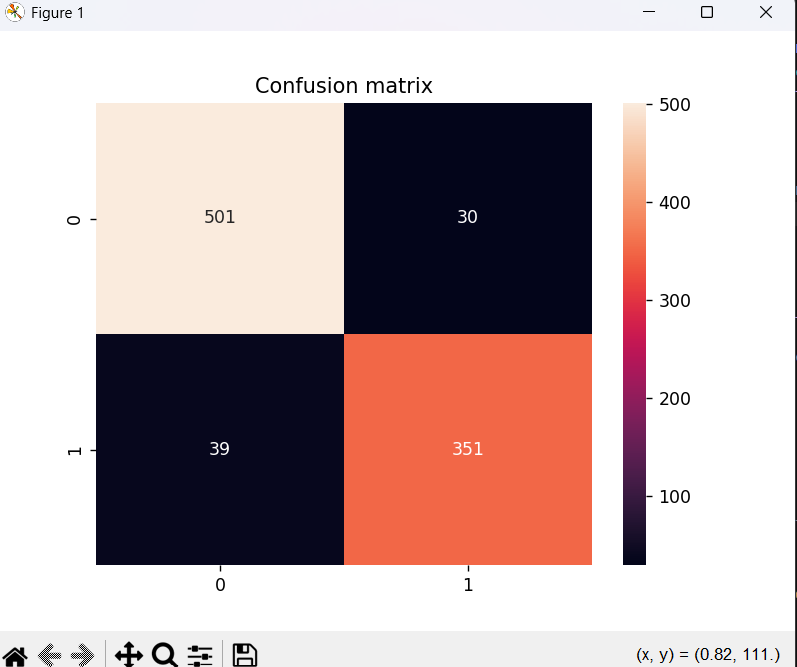

# Spam Email Detection Using Logistic Regression

## Overview

This project uses Machine Learning to classify emails as Spam or Not Spam using the Spambase dataset and Logistic Regression.

## Features

* Data preprocessing with Pandas
* Train-test split using Scikit-learn
* Logistic Regression model training
* Performance evaluation using:

  * Accuracy
  * Precision
  * Recall
  * F1 Score
* Confusion Matrix visualization using Seaborn

## Technologies Used

* Python
* Pandas
* NumPy
* Scikit-learn
* Matplotlib
* Seaborn

## Dataset

The project uses the Spambase dataset containing email features and spam labels.

## How to Run

1. Clone the repository
2. Install dependencies

```bash
pip install -r requirements.txt
```

3. Run the project

```bash
python spam_detector.py
```

## Output

* Accuracy Score
* Precision Score
* Recall Score
* F1 Score
* Confusion Matrix Heatmap

### Confusion Matrix


